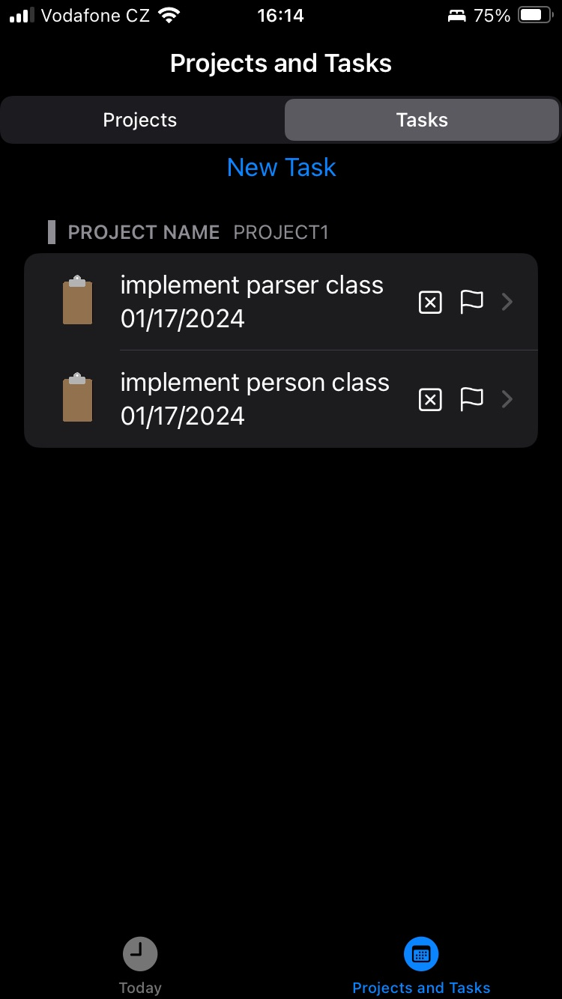
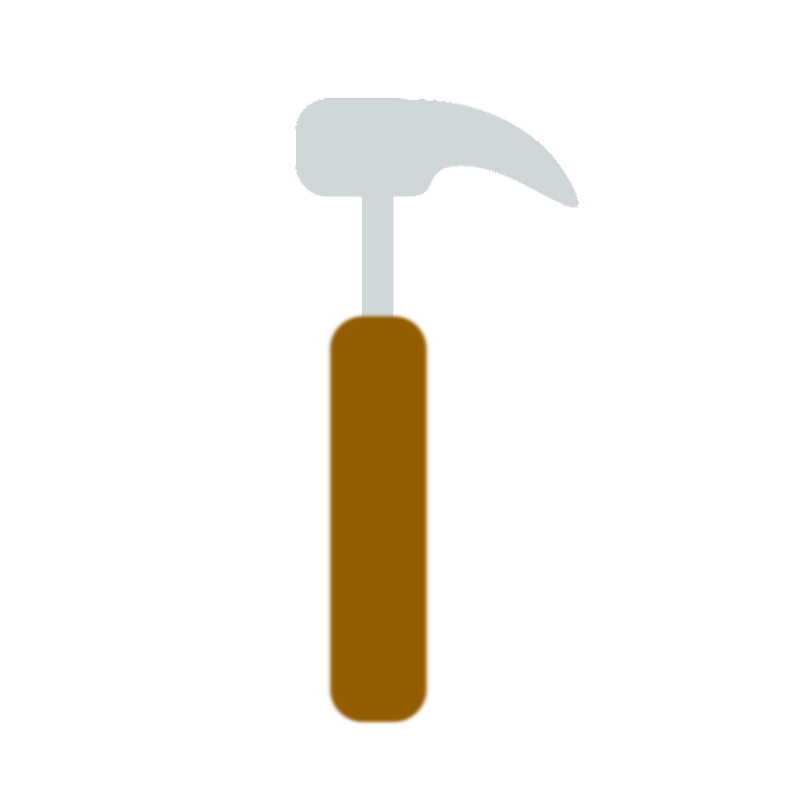
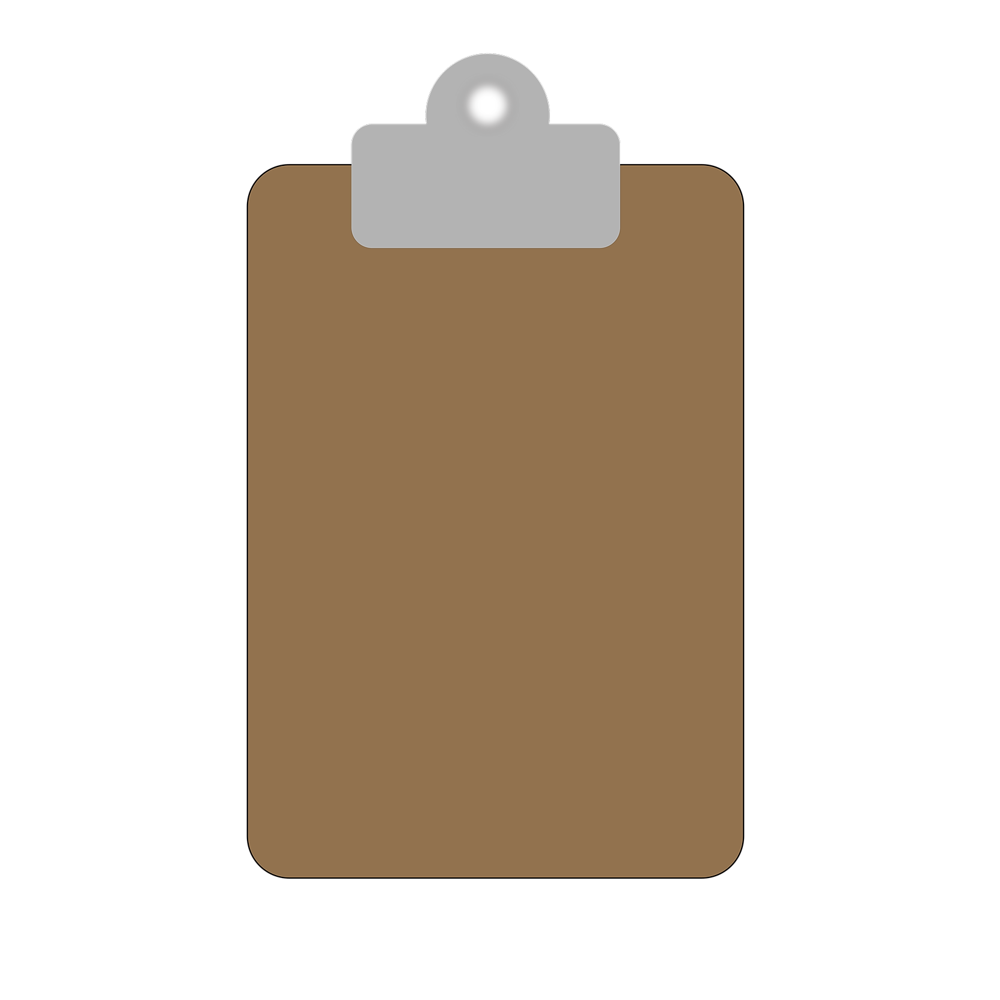

#   Tasker

   Tasker

Tasker is an application for managing projects and tasks written in swift for iOS. The source code is available from https://github.com/marekdolezel/iza_project2/tree/master/iza_project2

## Technical Features
- CoreData for permanent storage of objects
- SwiftUI (declarative approach to creating user interfaces)

## Features
- Add new project 
- Add new task to project
- View your projects and tasks
- Delete existing project and its tasks
- Delete particular tasks

## What does not work?
- Automatic sorting of tasks to tabs (Today's, This Week, This Month )
- Localization
- Passtrough of @Environment (see https://bugs.swift.org/browse/SR-11607), you have to add .environment(..) after SubView() as a workaround 

## How to Use

### Creating new project 
- Go to 'Projects and Tasks' bar 
- Click on 'New Project' at the top of the screen
- You will be presented with a sheet where you need to fill in the following information: name, description. Additionally, you might want to specify due date and urgency. Just press on the flag and the project will be set to urgent. 
- When you are done click 'Add'

### Creating new task 

- Go to 'Projects and Tasks' bar
- Click on a project you want to add the new task
- You will be presented with Project Detail screen; scroll down to the end of this screen and click on 'Add new task'
- You will be presented with a sheet where you need to fill in the following information: name, description. Additionally, you might want to specify due date and urgency. Just press on the flag and the task will be set to urgent. 
- When you are done click 'Add'

### Creating new task (from Tasks)
- Go to 'Projects and Tasks' bar 
- Click on 'Tasks' at the top of the screen, then 'New Task'
- You will be presented with a sheet where you need to fill in the following information: name, description, project. Use project picker to select project this tasks belongs to. Additionally, you might want to specify due date and urgency. Just press on the flag and the task will be set to urgent. 
- When you are done click 'Add'

### Deleting a task or project
- Long press on a task in 'Today's Tasks' and click 'Delete Task'
- Long prss on a task or project in 'Projects and Tasks' and click 'Delete Task' or 'Delete Project and its tasks'

### Mark project or task as done
- Long press on a task or project  in 'Projects and Tasks' or 'Today's Tasks' and click 'Mark as done'

